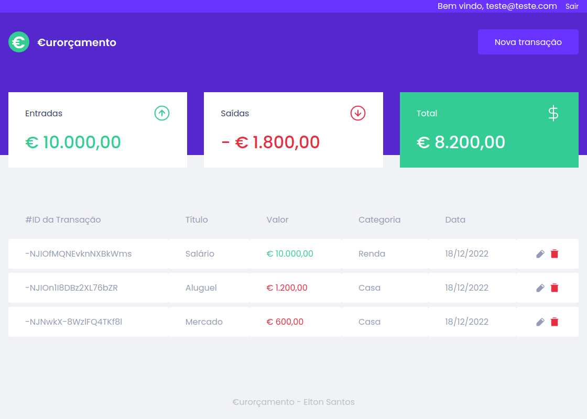

<p align="center">
  
</p>

<p align="center">
  <a href="#-technologies">Technologies</a>&nbsp;&nbsp;&nbsp;|&nbsp;&nbsp;&nbsp;
  <a href="#-getting-started">Getting started</a>&nbsp;&nbsp;&nbsp;|&nbsp;&nbsp;&nbsp;
  <a href="#-project">Project</a>&nbsp;&nbsp;&nbsp;|&nbsp;&nbsp;&nbsp;
  <a href="#-layout">Layout</a>&nbsp;&nbsp;&nbsp;|&nbsp;&nbsp;&nbsp;
  <a href="#-next-steps">Next steps</a>
</p>

<h1 align="center">
  <a href="https://eurorcamento.vercel.app" target="_blank">
    EURORÇAMENTO
  </a>
</h1>

---

## 🧪 Technologies

This project was developed using the following technologies:

- [React](https://pt-br.reactjs.org/)
- [Firebase](https://firebase.google.com/)
- [Styled Components](https://styled-components.com/)
- [React Toastify](https://fkhadra.github.io/react-toastify/introduction)
- [React Router DOM](https://reactrouter.com/)
- [React Modal](http://reactcommunity.org/react-modal/)
- [React Loading](https://github.com/fakiolinho/react-loading)
- [React Paginate](https://github.com/AdeleD/react-paginate)
- [Phosphor Icons](https://phosphoricons.com/)
- [Polished](https://polished.js.org/)
- [Yup](https://github.com/jquense/yup)

## 🚀 Getting started

Clone the project and access the folder

```bash
$ git clone https://github.com/eltonsantos/eurorcamento.git && cd eurorcamento
```

Follow the steps below

```bash
# Install the dependencies
$ npm install

# Start the project
$ npm run start
```

## 💻 Project

Application developed for personal purposes with objective to separate my personal finances in reais with my expenses in euros. It came from need of the application that I use not being able to have both currencies in the same account. So I created the Eurorçamento with a focus on the euro and during my time in Europe.

## 🔖 Layout

<p align="center">
  
</p>

## 🐾 Next steps

###### Escreverei essa parte em português

- [ ] Cobrir o sistema de testes! 👁‍🗨
- [ ] Criação de filtros por categoria, tipo e data da transação 🗃️
- [ ] Alterar visual em dark/light mode 🌗
- [ ] Coluna com contagem das transações 1️⃣
- [ ] E muito mais... ❤💪🏼

---

## 👨🏻‍💻 Author

<h3 align="center">
  
  <br/>
  <strong>Elton Santos</strong> 🚀
  <br/>
  <br/>

 <a href="https://www.linkedin.com/in/eltonmelosantos" alt="LinkedIn" target="blank">
    
  </a>

  <a href="mailto:elton.melo.santos@gmail.com?subject=Olá%20Elton" alt="Email" target="blank">
    
  </a>

<br/>

Made with ❤️ by Elton Santos 👋🏽 [Entre em contato!](https://www.linkedin.com/in/eltonmelosantos/)

</h3>
